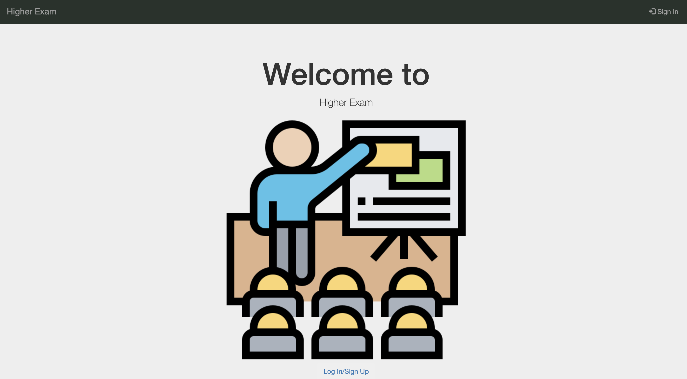

[](https://hopeful-wilson-29fa1d.netlify.app/firebase-functions/public/index.html)


# Higher Exam
This was a software engineering group project that was undertaken during semester B of our second year. The task was to create an online examination application in which 'Higher Exam' was our output. Overall, this project was successful as we received a first class for it!

You can view a live version here: (will be redirected to)
```
> https://hopeful-wilson-29fa1d.netlify.app/firebase-functions/public/index.html
```


Note:

As netlify only hosts static sites, you will need to click the link below after logging in as the login features if the site and som pages uses php. Most pages such as the admin page however, should be fine as they utilise firebase functions
```
> https://hopeful-wilson-29fa1d.netlify.app/firebase-functions/public/adminpage
```
- Or by clicking [here](https://hopeful-wilson-29fa1d.netlify.app/firebase-functions/public/index.html)
- After registering: [here](https://hopeful-wilson-29fa1d.netlify.app/firebase-functions/public/adminpage)

To get the fully working product, you will need to run it locally, with php enabled


## Links
Ridwan's Section:
- [My portfolio](https://ridwan.co.uk/)
- [By me a coffee](https://ko-fi.com/R1D1M1LL)
